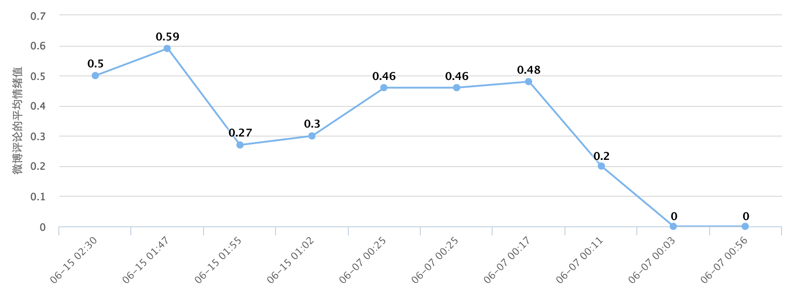

微博粉丝情绪分析
==============

获取其他用户对自己微博的评论，计算情绪值，绘出变化曲线。

### 运行

需要修改 weibo_sentiment/settings.py 的包括:

* app_key: 微博应用的 app_key
* app_secret: 微博应用的 app_secret
* base_url: 微博应用填写的域名
* redirect_url: 微博应用填写的回调地址

### License

MIT
